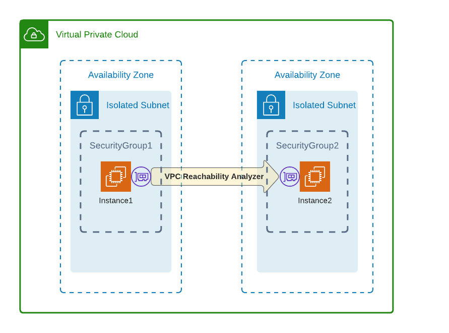

# Using VPC Reachability Analyzer to Verify and Troubleshoot Network Paths

## Problem
You have two EC2 instances deployed in isolated subnets. You need to troubleshoot SSH connectivity between them.

## Solution
You will create, analyze, and describe network insights by using the VPC Reachability Analyzer. Based on the results, you will add a rule to the security group of instance 2 that allows the SSH port (TCP port 22) from instance 1’s security group. Finally, you will rerun the VPC Reachability Analyzer and view the updated results (see Figure 2-8).



### Prerequisites
* VPC with isolated subnets in two AZs and associated route tables.
* Two EC2 instances deployed in the isolated subnets. You will need the ability to connect to these for testing.

## Preparation
### This recipe requires some “prep work” which deploys resources that you’ll build the solution on. You will use the AWS CDK to deploy these resources 

### In the root of this Chapter’s repo cd to the  “206-VPC-Reachability-Analyzer/cdk-AWS-Cookbook-206/” directory and follow the subsequent steps: 

```
cd 206-VPC-Reachability-Analyzer/cdk-AWS-Cookbook-206/
test -d .venv || python3 -m venv .venv
source .venv/bin/activate
pip install --upgrade pip
pip install -r requirements.txt
cdk deploy
```

### Wait for the cdk deploy command to complete. 

### We created a helper.py script to let you easily create and export environment variables to make subsequent commands easier. Run the script, and copy the output to your terminal to export variables:

`python helper.py`

## Steps

1. Create a network insights path specifying both of the EC2 instances you deployed and TCP port 22:
```
INSIGHTS_PATH_ID=$(aws ec2 create-network-insights-path \
    --source $INSTANCE_ID_1 --destination-port 22 \
    --destination $INSTANCE_ID_2 --protocol tcp \
    --output text --query NetworkInsightsPath.NetworkInsightsPathId)
```

2. Start the network insights analysis between the two instances using the `INSIGHTS_PATH_ID` created in the previous step:
```
ANALYSIS_ID_1=$(aws ec2 start-network-insights-analysis \
    --network-insights-path-id $INSIGHTS_PATH_ID --output text \
    --query NetworkInsightsAnalysis.NetworkInsightsAnalysisId)
```

3. Wait a few seconds until the analysis is done running and then view the results:
```
aws ec2 describe-network-insights-analyses \
    --network-insights-analysis-ids $ANALYSIS_ID_1
```

You should see output similar to the following (note the `NetworkPathFound` and `ExplanationCode` fields):
```
{
  "NetworkInsightsAnalyses": [
    {
      "NetworkInsightsAnalysisId": "nia-<<snip>",
      "NetworkInsightsAnalysisArn": "arn:aws:ec2:us-east-1:111111111111:network-insights-analysis/nia-<<snip>",
      "NetworkInsightsPathId": "nip-<<snip>",
      "StartDate": "2020-12-22T02:12:36.836000+00:00",
      "Status": "succeeded",
      "NetworkPathFound": false,
      "Explanations": [
        {
          "Direction": "ingress",
          "ExplanationCode": "ENI_SG_RULES_MISMATCH",
          "NetworkInterface": {
            "Id": "eni-<<snip>",
            "Arn": "arn:aws:ec2:us-east-1:11111111111:network-interface/eni-<<snip>"
          },
 ```
 4. Update the security group attached to instance 2. Add a rule to allow access from instance 1’s security group to TCP port 22 (SSH):
 ```
 aws ec2 authorize-security-group-ingress \
    --protocol tcp --port 22 \
    --source-group $INSTANCE_SG_ID_1 \
    --group-id $INSTANCE_SG_ID_2
 ```
 
 You should see output similar to the following:
 ```
 {
  "Return": true,
  "SecurityGroupRules": [
  {
    "SecurityGroupRuleId": "sgr-<<snip>>",
    "GroupId": "sg-<<snip>>",
    "GroupOwnerId": "111111111111",
    "IsEgress": false,
    "IpProtocol": "tcp",
    "FromPort": 22,
    "ToPort": 22,
    "ReferencedGroupInfo": {
      "GroupId": "sg-<<snip>>"
    }
  }
  ]
}
```

5. Rerun the network insights analysis. Use the same `INSIGHTS_PATH_ID` as you did previously:
```
ANALYSIS_ID_2=$(aws ec2 start-network-insights-analysis \
    --network-insights-path-id $INSIGHTS_PATH_ID --output text \
    --query NetworkInsightsAnalysis.NetworkInsightsAnalysisId)
```

6. Show the results of the new analysis:
```
aws ec2 describe-network-insights-analyses \
    --network-insights-analysis-ids $ANALYSIS_ID_2
```

You should see output similar to the following (note the `NetworkPathFound` field):
```
{
  "NetworkInsightsAnalyses": [
  {
    "NetworkInsightsAnalysisId": "nia-<<snip>>",
    "NetworkInsightsAnalysisArn": "arn:aws:ec2:us-east-1:111111111111:network-insights-analysis/nia-<<snip>>",
    "NetworkInsightsPathId": "nip-<<snip>>",
    "StartDate": "2021-02-21T23:52:15.565000+00:00",
    "Status": "succeeded",
    "NetworkPathFound": true,
    "ForwardPathComponents": [
      {
        "SequenceNumber": 1,
        "Component": {
        "Id": "i-<<snip>>",
...
```

## Validation checks
List the IP address for instance 2:
```
aws ec2 describe-instances --instance-ids $INSTANCE_ID_2 \
    --output text \
    --query Reservations[0].Instances[0].PrivateIpAddress
```

Connect to your EC2 instance by using SSM Session Manager (see [Recipe 1.6](https://github.com/AWSCookbook/Security/tree/main/106-Connecting-to-EC2-Instances-Using-Session-Manager)):
```
aws ssm start-session --target $INSTANCE_ID_1
```

Install the `Ncat` utility:
```
sudo yum -y install nc
```

Test SSH connectivity to instance 2 (use instance 2’s IP that you listed previously):
```
nc -vz $INSTANCE_IP_2 22
```

You should see output similar to the following:
```
Ncat: Version 7.50 ( https://nmap.org/ncat )
Ncat: Connected to 10.10.0.48:22.
Ncat: 0 bytes sent, 0 bytes received in 0.01 seconds.
sh-4.2$
```

Exit the Session Manager session:
```
exit
```

## Clean up 
### Delete the analyses:

```
aws ec2 delete-network-insights-analysis \
--network-insights-analysis-id $ANALYSIS_ID_1

aws ec2 delete-network-insights-analysis \
--network-insights-analysis-id $ANALYSIS_ID_2
```

### Delete the path:

```
aws ec2 delete-network-insights-path \
--network-insights-path-id $INSIGHTS_PATH_ID
```

### To clean up the environment variables, run the helper.py script in this recipe’s cdk- directory with the --unset flag, and copy the output to your terminal to export variables:

```
python helper.py --unset
```

### Unset the environment variable that you created manually:

```
unset INSIGHTS_PATH_ID
unset ANALYSIS_ID_1
unset ANALYSIS_ID_2
```

### Use the AWS CDK to destroy the resources, deactivate your Python virtual environment, and go to the root of the chapter:

```
cdk destroy && deactivate && rm -r .venv/ && cd ../..
```

## Discussion

A network insights path is a definition of the connectivity you want to test. Initially, there wasn’t SSH connectivity between the instances because the security group on the destination (instance 2) did not allow access. After you updated the security group associated with instance 2 and reran an analysis, you were able to verify successful connectivity. Using the [VPC Reachability Analyzer](https://docs.aws.amazon.com/vpc/latest/reachability/getting-started.html) is an efficient capability for network troubleshooting and validating configuration in a “serverless” manner. It does not require you to provision infrastructure to analyze, verify, and troubleshoot network connectivity.

> NOTE: VPC reachability has broad support of sources and destinations for resources within your VPCs. For a complete list of supported sources and destinations, see this support [document](https://docs.aws.amazon.com/vpc/latest/reachability/how-reachability-analyzer-works.html). 

VPC Reachability Analyzer provides explanation codes that describe the result of a network path analysis. In this recipe, you observed the code `ENI_SG_RULES_MISMATCH` that indicates that the security groups are not allowing traffic between the source and destination. The complete list of explanation codes is available in this [documentation](https://docs.aws.amazon.com/vpc/latest/reachability/explanation-codes.html).

### Challenge
Add an internet gateway to your VPC and test access to that from an instance.
